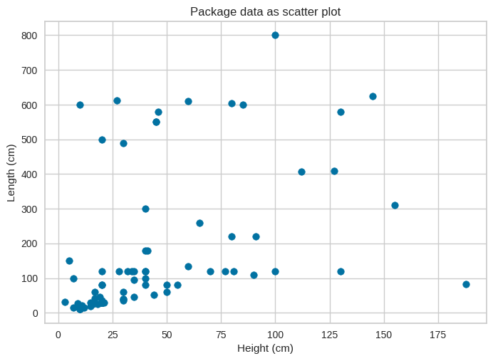
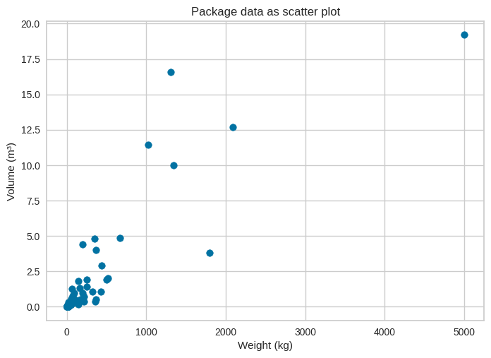
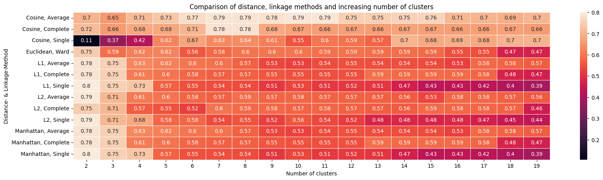
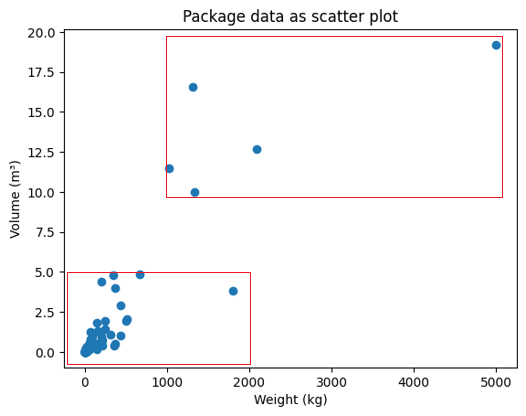

# Clustering mit Scikit-Learn

Autoren: Mario Pfob, Marius Harrass

---

## 1. Definition Cluster-Analyse

Bei der Cluster-Analyse handelt es sich um ein exploratives Verfahren zur Datenanalyse, welches unter anderem auch im Berech des unüberwachten maschinellen Lernens Einsatz findet. Das primäre Ziel einer Cluster-Analyse ist dabei, eine Menge von Klassifikationsobjekten in homogene Gruppen zusammenzufassen *(vgl. Backhaus, K. et al (2021))*. \
Unter dem Begriff 'Cluster-Analyse' können verschiedene Verfahren zur Anwendung kommen. Eine grundlegende Unterschiedung wird dabei zwischen hierarchischen und partitionierenden Verfahren gemacht. Beide Verfahren werden in Abschnitt 4 und Abschnitt 5 an einem Beispiel verdeutlicht.

 \
*Unterschiedung der Clustervefahren* \
*Eigene Darstellung nach Backhaus, K. et al (2021), S.507*

In der Praxis wird eine Cluster-Analyse häufig genutzt, um heterogene Datensätze in homogene Cluster aufzuteilen, die dann mit weiteren Analysemethoden genauer untersucht werden. \
Wichtig ist dabei die Abgrenzung zur Klassifikation. Die Cluster-Analyse zielt darauf ab, bisher unbekannte Gruppen innerhalb eines Datensatzes zu identifizieren. Bei der Klassifikation hingegen werden verschiedene Instanzen basierend auf deren Merkmalen bereits bestehenden Gruppen zugeordnet.

## 2. Kontext Datensatz

Für die Anwenderung der hierarchischen und partitionierenden Clusteranalyse wird der in *Tabelle 1* ausschnittsweise dargestellte Datensatz zugrunde gelegt.

\
*Tabelle 1: Ausschnitt Packstück-Datensatz*\
*Quelle: Eigendarstellung durch pandas*

Innerhalb des Datensatzes werden verschiedene Packstücke abgebildet. Die 'Package No' dient dabei als eindeutiger Identifikator. Die Kombinationen aus 'Weight', 'Width', 'Height' und 'Length' ergeben verschieden große und schwere Packstücke. Als ergänzende Information ist die 'Shipment No' angegeben, mit der mehrere Packstücke in der Abwicklung zusammengefasst sein können.\
Die in den folgenden Abschnitten angwandte Cluster-Analysen sollen der Beantwortung folgender Frage dienen:\
"Welche Gruppen gleichartiger Packstücke können gebildet werden, um diese mit spezialisierten Teams zu bearbeiten?"

## 3. Daten visualisieren & aufbereiten

Die Autoren *García, Salvador u. a. (2016)* stellen in ihrem Schaubild den Erkentnissgewinn aus Daten als iterierenden Prozess dar (siehe Bild *Knowledge Discovery in Databases - Prozess*). Es wird bei dem Prozess davon ausgegangen, dass die Daten nicht im gewünschten Format vorliegen oder beispielsweise Lücken innerhalb der Daten vorhanden sind. \
Dementsprechend beginnt das Schaubild bei dem Schritt der Problem-Spezifikation: Bezogen auf den vorliegenden Datensatz soll ein konkretes Problem bzw. Frage beantwortet werden.\
Ist eine Problemstellung festgelegt, folgt das Verständis. Damit ist gemeint, dass der Datensatz in seiner rohen Form betrachtet wird, um u.a. notwendige Aufgaben für den folgenden Schritt der Daten-Aufbereitung zu entdecken.\
Bei der Aufbereitung sind mehrere Optionen vorhanden, um die Qualität des Datensatzes zu verbessern. Diese Optionen sind auf der Grafik *Data prepocessing tasks* zu sehen. Des Weiteren geben *García, Salvador u. a. (2016)* mit dem Schaubild *Data reduction approaches* Möglichkeiten zur Reduzierung der **relevaten** Daten, ggf. wird somit ein besseres Ergebnis erziehlt.\
Im Prozess des Data-Mining werden wiederum die nun aufbereiteten Daten explizit mit statistischen Methoden betrachtet, bspw. durch lineare Regression, Klassifizierung, oder wie in diesem Projekt durch **Clustering**.\
Schlussendlich werden bei der Evaluation, der Bewertung, Muster aufgezeigt, bewertet und ggf. verglichen.\
Diese Muster werden dann im letzten Punkt der Ergebnis-Verwertung präsentiert, z.B. in Form von Charts.

 \
*Knowledge Discovery in Databases - Prozess* \
*Entnommen aus: García, Salvador u. a. (2016)*

 \
*Data prepocessing tasks* \
*Entnommen aus: García, Salvador u. a. (2016)*

 \
*Data reduction approaches* \
*Entnommen aus: García, Salvador u. a. (2016)*

#
Transferiert auf die Vorbereitung in diesem Abschnitt, ist dementsprechend zuerst eine Visualisierung der Daten notwendig. Die Daten können sowohl im ursprünglichen CSV-Format, aber auch als Tabelle oder als Plot (siehe *Plot 1*) betrachtet werden. Daraus leiten sich mehrere zu erledigende Aufgaben ab:

- **Data Cleaning**, bspw. ist es notwendig die deutsche Zahlenschreibweise auf die amerikanische Schreibweise anzupassen
- **Data Integration**, aus den Spalten 'Length', 'Height', 'Width' soll das dazugehörige Volumen berechnet werden
- **Data Normalization**, d.h. alle (metrischen) Spalten sollen auf eine einheitliche Metrik standardisiert werden
- **Feature Selection**, so werden bspw. die Spalten 'Package No' und 'Shipment No' für die Cluster-Analyse nicht benötigt

Die Bearbeitung dieser Aufgaben ist durch die Grafiken *Plot 2* & *Plot 3* und *Tabelle 2* zu nachzuvollziehen.

 \
*Plot 1: Der Packstücke-Datensatz bevor dem Prozess der Daten-Aufbereitung. Die Eigenschaften 'Length' und 'Height' sind als Scatter-Plot visualisiert* \
*Quelle: Eigendarstellung mittels Matplotlib*

 \
*Plot 2: Der Packstücke-Datensatz während der Daten-Aufbereitung. Die neue Eigenschaft 'Volumen' wird zusammen mit dem 'Gewicht'  als Scatter-Plot visualisiert* \
*Quelle: Eigendarstellung mittels Matplotlib*

 \
*Plot 3: Der Packstücke-Datensatz nach der Daten-Aufbereitung. Die Eigenschaften 'Volumen' und 'Gewicht' sind mit standardisisierten Skalen als Scatter-Plot visualisiert* \
*Quelle: Eigendarstellung mittels Matplotlib*

 \
*Tabelle 2: Die ersten zehn Zeilen des Datensatzes vor und nach der Aufbereitung* \
*Quelle: Eigendarstellung durch Pandas*

## 4. Cluster-Analyse: Hierarchisch

Um einen Eindruck für die hierarchische Cluster-Bildung in einem bestimmten Datensatz zu erlangen, führen *Schonlau, Matthias (2002)* das sogenannte **Dendrogramm** auf. Das Dendrogramm kann zu einem gewissen Teil mit dem Aufbau eines Familienstammbaums verglichen werden: Je nach Betrachtungsrichtung fügen sich die Datenpunkte (vgl. zu einzelne Personen im Familienstammbaum) entweder zusammen oder spalten sich auf. Für den Packstück-Datensatz ist das Dendrogramm unter *Plot 4* zu sehen.

 \
*Plot 4: Dendrogramm des Packstück-Datensatzes (Linkage ist ‘ward‘)* \
*Quelle: Eigendarstellung mittels Matplotlib*

#
Die Autoren *Sasirekha, K./Baby, P. (2013)* beschreiben derweil die zwei unterschiedlichen Möglichkeiten zur Clusterbildung, welche ebenfalls am Dendrogramm abzulesen sind:
- Divisiv (dt. spaltend), d.h. die Cluster werden von oben nach unten rekursiv gebildet
- Agglomerative, d.h. die Cluster von unten nach oben. Jeder Datenpunkt bekommt dabei zu Beginn sein eigenes Cluster. Diese einzelnen Cluster werden rekursiv verschmolzen

In den folgenden Abschnitten soll der Fokus auf der agglomerativen Clusterbildung liegen.

Wie bereits im Dendrogramm (*Plot 4*) zu sehen, ist die Distanz der Datenpunkte zueinander relevant für die Clusterbildung. Nach *Sasirekha, K./Baby, P. (2013)* existieren zur Distanz-Berechnung folgende mathematische Verfahren:
- Euklidische Distanz: $$ d(p, q) = {\sqrt{ \sum_{i=1}^n (q_i - p_i)^2 } } $$
- Quadratische euklidische Distanz *(nicht nativ in Scikit-learn)*: $$ d^2(p, q) = {\sqrt{ \sum_{i=1}^n (q_i - p_i)^2 } } $$
- Manhattan Distanz: $$ d(p, q) = { \sum_{i=1}^n | q_i - p_i | } $$
- Maximum Distanz *(nicht nativ in Scikit-learn)*: $$ ||x||_{max} = max(|x_1|, ..., |x_n|) $$
- Mahalanobis Distanz *(nicht nativ in Scikit-learn)*: $$ d(p,q) = \sqrt{(p-q)^T S^{-1} (p-q)} $$
- Kosinus Distanz: $$ d(p, q) = 1 - { \frac{\sum_{i=1}^n q_i p_i}{\sum_{i=1}^n q_i^2 \sum_{i=1}^n p_i^2} } $$

Derweil beschreiben *Carvalho, Alexandre X. Y. u. a. (2009)* zwei weitere Verfahren zur Distanz-Berechnung:
- L2 (euklidische Norm): $$ ||v||_2 = \sqrt{\sum_{i=1}^n x^2} $$
- L1 (Summennorm): $$ ||x||_1 = {\sum_{i=1}^n |x_i|} $$

Nachdem nun verschiedene Methoden zur Distanz-Berechnung vorliegen, fehlt für die Bildung der Cluster eine Methode zu welcher Distanz ein Cluster gebildet werden kann. *Murtagh, F. (1983)* führt dabei sechs Möglichkeiten auf:
- **Single linkage**, dabei wird der minimalste Abstand zwischen zwei Clustern gemessen. Es werden die Cluster mit dem geringsten Wert kombiniert
- **Complete linkage**, dabei wird der maximalste Abstand zwischen zwei Clustern gemessen. Es werden die Cluster mit dem geringsten Wert kombiniert
- **Average linkage**, dabei wird der Mittelwert aller Abstände zwischen zwei Clustern gemessen. Es werden die Cluster mit dem geringsten Wert kombiniert
- **Median linkage** *(nicht nativ in Scikit-learn)*, dabei wird der Median aller Abstände zwischen zwei Clustern gemessen. Es werden die Cluster mit dem geringsten Wert kombiniert
- **Centroid linkage** *(nicht nativ in Scikit-learn)*, dabei wird der Abstand zweier Cluster-Schwerpunkte gemessen. Es werden die Cluster mit dem geringsten Wert kombiniert
- **Ward‘s method**, dabei wird sich für die Cluster-Kombination mit minalsten Zuwachs der totalen Varianz entschieden

Für einen Vergleich der verschiedenen Methoden zur Distanz-Berechnung, Cluster-Bildung und der daraus entstehenden Cluster, ist gemäß *Shahapure, Ketan R./Nicholas, Charles (2020)* der **Silhouette-Score** eine geeignete Metrik. Dieser Score setzt sich aus dem Mittelwert aller Silhouetten-Koeffizienten zusammen. Ein Score nahe **1** bedeutet dabei, dass die Datenpunkte in den korrekten Cluster liegen. Wohingegen ein Score nahe **-1** aussagt, dass die Datenpunkte in den falschen Clustern liegen. Ist der Score nahe **0**, existieren möglicherweise Überlappungen zwischen den Clustern.

In *Plot 5* ist ein Vergleich der in Scikit-Learn vorhandenen Methoden zur Distanz-Berechnung und Cluster-Bildung zu sehen. Diese Methoden werden jeweils durch den Silhouette-Score verglichen. Dabei sei angemerkt, dass die Ward-Methode in Scikit-Learn lediglich mit der euklidischen Distanz genutzt werden kann. Durch *Plot 5* ist ersichtlich, dass die L1- & Manhattan-Distanz mit dem minimalsten Abstand und bei zwei Clustern den besten Score vorweisen kann. In *Plot 6* ist schlussendlich der Packstück-Datensatz mit den Cluster-Ergebnissen aus den L1- und Single-Linkage-Methoden visualisiert.

 \
*Plot 5: Vergleich der Methoden zur Distanz-Berechnung, Cluster-Bildung und der Anzahl der Cluster* \
*Quelle: Eigendarstellung mittels Seaborn*

 \
*Plot 6: Der Packstück-Datensatz mit der vorgeschlagenen Anzahl von zwei Hierarchischen-Clustern* \
*Quelle: Eigendarstellung mittels Matplotlib*

## 5. Cluster-Analyse: KMeans

Die K-Means Analyse ist eine der am häufigsten angewandten Techniken im Rahmen von partitionierenden Cluster-Analysen.\
Grundlage ist der in 1982 veröffentlichte Lloyds-Algorithmus *(vgl. Shindler, M)*.\
Innerhalb eines Datensatzes wird eine definierte Anzahl von Cluster-Zentren zufällig gewählt. Die Datenpunkte des Datensatzes werden dann demjenigen Cluster zugeordnet, dessen Varianz am geringsten erhöht wird. Grundlage der Varianzberechnung bildet dabei die euklidische Distanz zwischen den Datenpunkten innerhalb eines Clusters und dem jeweiligen Clusterzentrum.\
Ist die Zuordnung aller Datenpunkte erfolgt, wird der Mittelwert aller Datenpunkte innerhalb eines Clusters berechnet und als neues Clusterzentrum definiert. Anschließend wird eine erneute Zuordnung der Datenpunkte zu den nun verändert positionierten Clusterzentren vorgenommen.
Diese Schritte werden iterativ ausgeführt, wobei Datenpunkte zwischen den Clustern wechseln können.\
Der iterative Prozess wird beendet, sobald keine Neuzuordnung von Datenpunkten mehr erfolgt.

\
*Prozess der k-means Methode*\
*Entnommen aus: Backhaus, K. et al. (2021), S.567*

Die wesentlichen Schritte, die Definition der initialen Clusterzentren (Cluster-Seeds) sowie die Zuordnung der Datenpunkte zu den Clustern haben in den vergangene Jahren verschieden Weiterentwicklungen erfahren.\
Einen Vorschlag zur optimierten Auswahl der initialen Clusterzentren machen David Arthur und Sergei Vassilvitskii im Jahr 2007. Grundlage der von Ihnen vorgeschlagenen Verbessrung k-means++ bildet eine Anpassung der Wahrscheinlichkeitsverteilung bei der Auswahl der initalen Clusterzentren.\
Statt alle Clusterzentren mit einer gleichförmigen Wahrscheinlichkeit innerhalb des Datenraumes auszuwählen wird lediglich das erste Clusterzentrum vollständig zufällig ausgewählt. Bei der Auwahl der weiteren Clusterzentren steigt die Wahrscheinlichkeit einer Wahl mit der Entferung zum nächstgelegenen, bereits gewählten Clusterzentrum. Diese angepasste Auswahl hat in zahlreichen Experimenten zu einer geringeren Varianz innerhalb der Cluster geführt, als mit einer regulären k-means Analyse erreicht werden konnte *(vgl. Arthur, D. (2007))*.\

Für die Zuordnung der Datenpunkte zu den Clustern schlägt Charles Elkan eine Optimierung vor *(Elkan, C. 2007)*. Kern des nach seinem Autor benannten Elkan-Algorithmus ist die Anwendung der Dreiecksungleichung. Diese besagt, dass eine Seite eines Dreiecks maximal so lange sein kann, wie die Summe der beiden anderen. Elkan bringt diese Gleichung für den k-means Algorithmus folgendermaßen zur Anwendung:

Wenn 1/2d(*c*,*c'*) >= d(*x*,*c*) dann d(*x*,*c'*) >= d(*x*,*c*)

Wenn der halbe Abstand zwischen den Clusterzentren *c* und *c'* größer ist, als der Abstand von Datenpunkt *x* zu *c*, so muss der Abstand von *x* zu *c'* größer sein, als von *x* zu *c*.\
Folglich kann ohne eine genaue Berechnung von d(*x*,*c'*) eine sichere Zuordnung von *x* zum Cluster um *c'* vorgenommen werden.
Hierdurch kann die Abfolge der k-means Methode beschleunigt werden, indem redundante Berechnungen nicht gemacht werden müssen.

#
Im Rahmen der scikit.learn Anwendung für den k-means Algorithmus werden k-means++ und der Elkan-Algorithmus angeboten. Damit ergeben sich folgende Varianten des k-means Algorithmus.

- **random, Lloyd**\
  Zufällige Auswahl der Cluster Seeds, Zuordnung nach dem Lloyd-Algorithmus
- **random, Elkan**\
  Zufällige Auswahl der Cluster Seeds, Zuordnung nach dem Elkan-Algorithmus
- **k-means++, Lloyd**\
  Auswahl der Cluster Seeds nach k-means++, Zuordnung nach dem Lloyd-Algorithmus
- **k-means++, Elkan**\
  Auswahl der Cluster Seeds nach k-means++, Zuordnung nach dem Elkan-Algorithmus
 
 Um die Eignung dieser Kombinationen für den Packstück-Datensatz zu untersuchen wird analog zur Anwendung bei der hierachischen Clusterung auch hier der Silhouette-Score genutzt.

 \
*Plot 7: Vergleich der Methoden zur Cluster-Seed Definition und des Berechnungs-Algorithmus*\
*Quelle: Eigendarstellung mittels Seaborn*

Die in *Plot 7* dargestellte Heatmap zeigt eindeutig, dass zwei Cluster die geeignetste Anzahl für den vorliegenden Datensatz ist. Bei dieser Clusteranzahl wir der höchste Silhouette-Score erreicht. Darüber hinaus stellt sich kein Unterschied zwischen den verschiedenen Varianten der k-means Methode ein. Bei Betrachtung der gesamten Heatmap lässt sich jedoch festellen, dass die insgesamte Qualität der Cluster bei einer Anwendung von k-means++ mit Elkan-Algorithmus am höchsten ist.\
Daher wird diese Kombination für die in *Plot 8* dargestellte Clusteranalyse des Packstück-Datensatzes verwendet.

 \
*Plot 8: Der Packstück-Datensatz mit der vorgeschlagenen Anzahl von zwei Clustern nach k-means* \
*Quelle: Eigendarstellung mittels Matplotlib*

## 6. Fazit
- **Lessons-Learned #1**: Zu verwendete Cluster-Methode hängt von Verteilung der Daten ab. Die Daten-Aufbereitung ist daher von zentraler Bedeutung
- **Lessons-Learned #2**: Der Silhouette-Score ist eine wichtige Metrik zur Bewertung des Clusterings
- **Ausblick**: Weitere mögliche Cluster-Methoden: GMM, DBSCAN, …
- **Relevant**: Interpretation des Ergebnisses, siehe dazu *Kapitel 7*

## 7. Interpretation der Ergebnisse

Um die Ergebnisse der Clusteranalysen in den Sachverhalt des betrachteten Datensatzes einzuordnen wird die eingangs gestellte Frage auf die Ergebnisse bezogen.\
"Welche Gruppen gleichartiger Packstücke können gebildet werden, um diese mit spezialisierten Teams zu bearbeiten?"

Die Ergebnisse der Analyse-Methoden liefern hierzu keine eindeutige Antwort. Zwar wird in beiden Fällen, die selbe Anzahl von Clustern (zwei) als optimale Anzahl identifiziert, jedoch fällt die Ausprägung dieser Cluster unterschiedlich aus.\
Dementsprechend kann das Ergebnis nicht ohne weitere Betrachtung in die Praxis übertragen werden. Es sind die Rahmenbedingungen zu betrachten, die im unternehmerischen Umfeld vorherrschen.\
Im vorliegende Fall, der Bearbeitung von Packstücken, sind beispielhaft folgende Faktoren zu berücksichtigen:
- Anzahl und Qualifikation der Mitarbeiter\
  Kann eine Aufteilung vorgenommen werden?\
  Sind für manche Aufgaben spezialisierte Qualifikationen nötig?
- Unterschiede in Bearbeitungprozessen\
  Gibt es Unterschiede in den internen Prozessen bei verschiedenen Packstückgrößen, die z.B. zu anderen Bearbeitungszeiten führen?\
  Gibt es spezielle Anforderungen z.B. Sondergenehmigungen für den Straßentransport? 
- Externe Einschränkungen\
  Sind verschiedene Partner (z.B. Spedition, Paketdienst) nötig?\
  Gibt es Regularien (z.B. max. Gewicht für Paketdienst), die einzuhalten sind?

Unter Berücksichtigung dieser Kriterien scheint eine Aufteilung ein zwei Gruppen gleichartiger Packstücke sinnvoll.\
- "Paket und Speditionsware"\
  Packstücke bis 5,0m³ und 2.000kg
- "Großware und Sondertransporte"\
  Packstücke ab 10m³ und 1.000 bis 5.000kg

 \
*Plot 9: Zur praktischen Anwendung betrachtete Cluster-Zuordnung* \
*Quelle: Eigendarstellung mittels Matplotlib*

 
 
